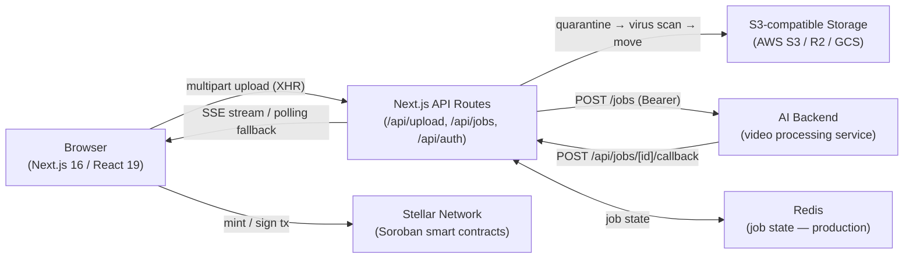

# ClipCash

ClipCash is an AI-powered platform that turns long-form videos into short, platform-ready clips for TikTok, Instagram Reels, YouTube Shorts, and more. Creators preview and select every clip before posting, with optional NFT minting on the Stellar network for true content ownership and on-chain royalties.

## Architecture



For a deep dive into each system — upload quarantine, AES-GCM wallet encryption, JWT session shape, Zustand store layout — see **[docs/ARCHITECTURE.md](docs/ARCHITECTURE.md)**.

For the current security posture, threat model, and reporting process, see **[docs/SECURITY.md](docs/SECURITY.md)**.

For the full HTTP API reference — every endpoint, request/response examples, authentication, and error shapes — see **[docs/API.md](docs/API.md)**. A machine-readable OpenAPI 3.1 spec is available at **[docs/openapi.yaml](docs/openapi.yaml)**.

---

## Quick Start

```bash
# 1. Clone
git clone https://github.com/ANYTECHS/clips-frontend.git
cd clips-frontend

# 2. Install dependencies
npm install

# 3. Configure environment
cp .env.example .env.local
# Edit .env.local — the minimum required variables are listed below

# 4. Start the development server
npm run dev
```

Open [http://localhost:3000](http://localhost:3000). The app runs fully offline with in-memory job storage and virus scanning disabled in development.

---

## API Documentation

The HTTP API is documented in **[docs/API.md](docs/API.md)** and described by an OpenAPI 3.1 spec at **[docs/openapi.yaml](docs/openapi.yaml)**.

### Authentication

Most endpoints require an authenticated session. Callers authenticate in one of two ways:

- **Browser session cookie** — set by NextAuth after an OAuth sign-in (`/api/auth/*`). Sent automatically by the browser.
- **Bearer token** — send `Authorization: Bearer <token>` for server-to-server calls (e.g. the AI backend calling back into the app).

Endpoints that are called by the AI backend additionally require the shared secret header `x-callback-secret: <AI_BACKEND_CALLBACK_SECRET>`.

### Endpoints

| Method | Path | Auth | Description |
|---|---|---|---|
| `POST` | `/api/upload` | Session | Upload a source video (multipart). Returns a job id. |
| `GET` | `/api/jobs` | Session | List the caller's jobs. |
| `GET` | `/api/jobs/[id]` | Session | Fetch a single job's status and metadata. |
| `GET` | `/api/jobs/[id]/stream` | Session | SSE stream of job progress (polling fallback available). |
| `POST` | `/api/jobs/[id]/callback` | Callback secret | AI backend reports job completion/failure. |
| `GET` | `/api/auth/session` | Public | Current session (NextAuth). |
| `POST` | `/api/auth/signin` | Public | Begin OAuth sign-in. |
| `POST` | `/api/auth/signout` | Session | End the current session. |

### Example: upload a video

```bash
curl -X POST http://localhost:3000/api/upload \
  -H "Cookie: next-auth.session-token=<token>" \
  -F "file=@clip.mp4"
```

```json
{ "jobId": "job_01H...", "status": "queued" }
```

### Example: fetch a job

```bash
curl http://localhost:3000/api/jobs/job_01H... \
  -H "Cookie: next-auth.session-token=<token>"
```

```json
{
  "id": "job_01H...",
  "status": "completed",
  "clips": [{ "id": "clip_1", "url": "https://.../clip_1.mp4" }]
}
```

### Error responses

All errors share a consistent JSON shape:

```json
{ "error": "Unauthorized", "message": "Authentication required" }
```

| Status | Meaning |
|---|---|
| `400` | Malformed request (missing/invalid fields) |
| `401` | Missing or invalid authentication |
| `403` | Authenticated but not permitted (e.g. bad callback secret) |
| `404` | Resource not found |
| `413` | Upload exceeds the size limit |
| `429` | Rate limit exceeded |
| `500` | Unexpected server error |

---

## Environment Variables

Copy `.env.example` to `.env.local` and fill in the values. The table below lists every variable; required ones will cause the server to fail or the feature to be silently broken if omitted.

### Auth

| Variable | Required | Description |
|---|---|---|
| `NEXTAUTH_SECRET` | **Yes** | Session signing key. Generate: `openssl rand -base64 32` |
| `NEXTAUTH_URL` | **Yes** | Canonical app URL, e.g. `http://localhost:3000` |
| `GOOGLE_CLIENT_ID` | **Yes** | Google OAuth client ID |
| `GOOGLE_CLIENT_SECRET` | **Yes** | Google OAuth client secret |
| `APPLE_ID` | Optional | Apple Sign-In service ID |
| `APPLE_TEAM_ID` | Optional | Apple developer team ID |
| `APPLE_KEY_ID` | Optional | Apple Sign-In key ID |
| `APPLE_PRIVATE_KEY` | Optional | Apple Sign-In private key (full PEM) |
| `TWITTER_CLIENT_ID` | Optional | Twitter OAuth 2.0 client ID |
| `TWITTER_CLIENT_SECRET` | Optional | Twitter OAuth 2.0 client secret |
| `INSTAGRAM_CLIENT_ID` | Optional | Instagram OAuth client ID |
| `INSTAGRAM_CLIENT_SECRET` | Optional | Instagram OAuth client secret |
| `TIKTOK_CLIENT_KEY` | Optional | TikTok OAuth client key |
| `TIKTOK_CLIENT_SECRET` | Optional | TikTok OAuth client secret |

### AI Backend

| Variable | Required | Description |
|---|---|---|
| `NEXT_PUBLIC_AI_API_URL` | Prod only | Base URL of the AI video processing service. If unset in dev, jobs stay `queued` — no crash. |
| `AI_BACKEND_SECRET` | Prod only | Bearer token sent on outbound dispatches to the AI service |
| `AI_BACKEND_CALLBACK_SECRET` | **Yes (prod)** | Secret the AI service must send when calling `/api/jobs/[id]/callback`. Generate: `openssl rand -hex 32` |
| `NEXT_PUBLIC_API_URL` | Optional | Base URL for the main backend API (user profile, earnings). Defaults to `http://localhost:4000`. |

### Cloud Storage

Files require a valid S3-compatible bucket to upload. In development you can leave these blank — uploads will fail but the rest of the app works.

| Variable | Required | Description |
|---|---|---|
| `CLOUD_STORAGE_BUCKET` | **Yes (prod)** | Bucket name |
| `CLOUD_STORAGE_REGION` | **Yes (prod)** | Region, e.g. `us-east-1`. Use `auto` for Cloudflare R2. |
| `AWS_ACCESS_KEY_ID` | **Yes (prod)** | Access key / account ID |
| `AWS_SECRET_ACCESS_KEY` | **Yes (prod)** | Secret key / API token |
| `CLOUD_STORAGE_PROVIDER` | Optional | `s3` (default) \| `r2` \| `gcs` |
| `CLOUD_STORAGE_ENDPOINT` | Optional | Custom endpoint for R2/GCS S3 interop. Leave blank for AWS S3. |
| `CLOUD_STORAGE_KEY_PREFIX` | Optional | Object key prefix (default: `uploads/`) |

### Redis

| Variable | Required | Description |
|---|---|---|
| `REDIS_URL` | **Yes (prod)** | Redis connection string, e.g. `redis://:password@hostname:6379`. Without this, job state lives in-process — fine for dev, broken on multi-instance deployments. |

### Stellar / Blockchain

| Variable | Required | Description |
|---|---|---|
| `NEXT_PUBLIC_STELLAR_NETWORK` | Optional | `testnet` (default) \| `mainnet` |
| `NEXT_PUBLIC_STELLAR_RPC` | Optional | Custom Soroban RPC URL override |
| `NEXT_PUBLIC_STELLAR_NFT_CONTRACT_ID` | Optional | Soroban NFT contract address (testnet) |
| `NEXT_PUBLIC_STELLAR_NFT_CONTRACT_ID_MAINNET` | Optional | Soroban NFT contract address (mainnet) |

### Virus Scanning

Scanning is **enabled by default in production** and **disabled in development**. If `VIRUS_SCAN_ENABLED` is not set the default applies.

| Variable | Required | Description |
|---|---|---|
| `VIRUS_SCAN_PROVIDER` | Optional | `clamav` (default) \| `virustotal` \| `cloudmersive` \| `disabled` |
| `VIRUS_SCAN_ENABLED` | Optional | `true` \| `false`. Overrides the production/development default. |
| `VIRUS_SCAN_TIMEOUT` | Optional | Scan timeout in ms (default: `30000`) |
| `VIRUS_SCAN_QUARANTINE_PREFIX` | Optional | S3 prefix for pre-scan staging (default: `uploads/quarantine/`) |
| `CLAMAV_API_URL` | Conditional | Required when `VIRUS_SCAN_PROVIDER=clamav`. HTTP endpoint of the ClamAV sidecar, e.g. `http://localhost:8080`. |
| `VIRUSTOTAL_API_KEY` | Conditional | Required when `VIRUS_SCAN_PROVIDER=virustotal` |
| `CLOUDMERSIVE_API_KEY` | Conditional | Required when `VIRUS_SCAN_PROVIDER=cloudmersive` |

### Monitoring & Analytics

| Variable | Required | Description |
|---|---|---|
| `NEXT_PUBLIC_SENTRY_DSN` | Optional | Sentry DSN for error monitoring |
| `NEXT_PUBLIC_ANALYTICS_PROVIDER` | Optional | `none` (default) \| `ga4` \| `plausible` \| `custom` |
| `NEXT_PUBLIC_GA_MEASUREMENT_ID` | Optional | Google Analytics 4 measurement ID (e.g. `G-XXXXXXXXXX`) |
| `NEXT_PUBLIC_PLAUSIBLE_DOMAIN` | Optional | Plausible analytics domain |
| `NEXT_PUBLIC_ANALYTICS_ENDPOINT` | Optional | Custom analytics POST endpoint |

### Social Recovery & Email

| Variable | Required | Description |
|---|---|---|
| `EMAIL_FROM` | Optional | From address for guardian approval emails (default: `noreply@clipcash.ai`) |
| `RESEND_API_KEY` | Optional | [Resend](https://resend.com) API key for transactional email |

### AI Transformation

| Variable | Required | Description |
|---|---|---|
| `NEXT_PUBLIC_TRANSFORM_STYLES` | Optional | Comma-separated list of available styles (default: `anime,cinematic,sketch,watercolor`) |

---

## Development Scripts

| Script | Command | What it does |
|---|---|---|
| Dev server | `npm run dev` | Starts Next.js at [localhost:3000](http://localhost:3000) with hot reload |
| Production build | `npm run build` | Compiles and optimises for production |
| Production server | `npm run start` | Serves the production build |
| Lint | `npm run lint` | Runs ESLint across the codebase |
| Unit tests | `npm run test` | Runs Jest test suite |
| E2E tests | `npm run test:e2e` | Runs Playwright tests against a local dev server (auto-started). Sets `E2E_SKIP_MIDDLEWARE=true` so auth is bypassed. |
| Storybook | `npm run storybook` | Starts Storybook component explorer at [localhost:6006](http://localhost:6006) |
| Build Storybook | `npm run build-storybook` | Builds a static Storybook site |
| Bundle analysis | `npm run analyze` | Builds with `@next/bundle-analyzer` — opens bundle report in browser |
| Changeset | `npm run changeset` | Creates a versioning entry for your PR (see [CONTR

/* … truncated 5008 chars — edit only what you need near the top … */
