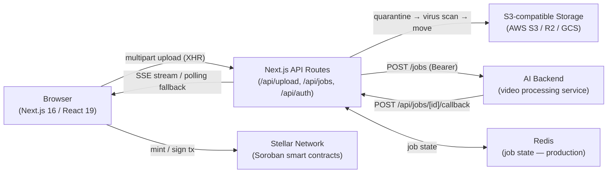

# ClipCash

ClipCash is an AI-powered platform that turns long-form videos into short, platform-ready clips for TikTok, Instagram Reels, YouTube Shorts, and more. Creators preview and select every clip before posting, with optional NFT minting on the Stellar network for true content ownership and on-chain royalties.

## Architecture



### System Overview

ClipCash is a single Next.js application that serves both the React UI and the API routes, backed by an external AI video-processing service, S3-compatible object storage, and the Stellar network for on-chain ownership.

| Layer | Responsibility |
|---|---|
| **Frontend** | Next.js App Router pages, React 19 components, Zustand stores for client state |
| **API Routes** | Auth (NextAuth), upload handling, job orchestration, AI callbacks, SSE streaming |
| **AI Backend** | External service that transcribes, segments, and renders clips |
| **Storage** | S3-compatible bucket holding source videos and rendered clips |
| **Job State** | Redis in production; in-memory fallback for local development |
| **Blockchain** | Soroban smart contracts on Stellar for NFT minting and royalties |

### Data Flow

1. **Upload** — the browser streams the source video to `/api/upload` via XHR. The API writes it to a quarantine prefix, runs the configured virus scan, then moves the object to its final key.
2. **Dispatch** — the API creates a job record and `POST`s it to the AI backend with a Bearer token.
3. **Processing** — the AI backend transcribes and segments the video, then calls back to `/api/jobs/[id]/callback` with the generated clips.
4. **Delivery** — the browser receives progress over an SSE stream, falling back to polling when SSE is unavailable.
5. **Minting** — when a creator mints a clip, the browser signs a transaction that the Soroban contract records on Stellar.

### Key Design Decisions

- **Single Next.js app for UI + API** — keeps deployment simple and lets API routes share types and utilities with the frontend. Trade-off: heavier serverless functions and no independent scaling of the API tier.
- **External AI backend** — video processing is CPU/GPU intensive and long-running, so it lives outside the request/response cycle. Trade-off: an extra network hop and a callback contract to maintain.
- **Quarantine-then-scan uploads** — files are staged and scanned before becoming visible, so untrusted content never reaches the serving path. Trade-off: extra storage writes and latency per upload.
- **Redis for job state** — job state must be shared across instances in production; an in-memory store keeps local development dependency-free. Trade-off: two code paths to keep in sync.
- **Stellar/Soroban for ownership** — low fees and fast finality make on-chain minting practical for individual creators. Trade-off: wallet UX and network-specific contract IDs.

### Technology Choices

- **Next.js 16 / React 19** — App Router, server components, and built-in API routes in one framework.
- **Zustand** — lightweight client state without the boilerplate of a larger store library.
- **S3-compatible storage** — portable across AWS S3, Cloudflare R2, and GCS via the S3 interop API.
- **Redis** — simple, fast shared state for job tracking across instances.
- **Stellar / Soroban** — low-cost smart contracts for NFT ownership and royalties.

For a deep dive into each system — upload quarantine, AES-GCM wallet encryption, JWT session shape, Zustand store layout — see **[docs/ARCHITECTURE.md](docs/ARCHITECTURE.md)**.

For the current security posture, threat model, and reporting process, see **[docs/SECURITY.md](docs/SECURITY.md)**.

---

## Quick Start

```bash
# 1. Clone
git clone https://github.com/ANYTECHS/clips-frontend.git
cd clips-frontend

# 2. Install dependencies
npm install

# 3. Configure environment
cp .env.example .env.local
# Edit .env.local — the minimum required variables are listed below

# 4. Start the development server
npm run dev
```

Open [http://localhost:3000](http://localhost:3000). The app runs fully offline with in-memory job storage and virus scanning disabled in development.

---

## Environment Variables

Copy `.env.example` to `.env.local` and fill in the values. The table below lists every variable; required ones will cause the server to fail or the feature to be silently broken if omitted.

### Auth

| Variable | Required | Description |
|---|---|---|
| `NEXTAUTH_SECRET` | **Yes** | Session signing key. Generate: `openssl rand -base64 32` |
| `NEXTAUTH_URL` | **Yes** | Canonical app URL, e.g. `http://localhost:3000` |
| `GOOGLE_CLIENT_ID` | **Yes** | Google OAuth client ID |
| `GOOGLE_CLIENT_SECRET` | **Yes** | Google OAuth client secret |
| `APPLE_ID` | Optional | Apple Sign-In service ID |
| `APPLE_TEAM_ID` | Optional | Apple developer team ID |
| `APPLE_KEY_ID` | Optional | Apple Sign-In key ID |
| `APPLE_PRIVATE_KEY` | Optional | Apple Sign-In private key (full PEM) |
| `TWITTER_CLIENT_ID` | Optional | Twitter OAuth 2.0 client ID |
| `TWITTER_CLIENT_SECRET` | Optional | Twitter OAuth 2.0 client secret |
| `INSTAGRAM_CLIENT_ID` | Optional | Instagram OAuth client ID |
| `INSTAGRAM_CLIENT_SECRET` | Optional | Instagram OAuth client secret |
| `TIKTOK_CLIENT_KEY` | Optional | TikTok OAuth client key |
| `TIKTOK_CLIENT_SECRET` | Optional | TikTok OAuth client secret |

### AI Backend

| Variable | Required | Description |
|---|---|---|
| `NEXT_PUBLIC_AI_API_URL` | Prod only | Base URL of the AI video processing service. If unset in dev, jobs stay `queued` — no crash. |
| `AI_BACKEND_SECRET` | Prod only | Bearer token sent on outbound dispatches to the AI service |
| `AI_BACKEND_CALLBACK_SECRET` | **Yes (prod)** | Secret the AI service must send when calling `/api/jobs/[id]/callback`. Generate: `openssl rand -hex 32` |
| `NEXT_PUBLIC_API_URL` | Optional | Base URL for the main backend API (user profile, earnings). Defaults to `http://localhost:4000`. |

### Cloud Storage

Files require a valid S3-compatible bucket to upload. In development you can leave these blank — uploads will fail but the rest of the app works.

| Variable | Required | Description |
|---|---|---|
| `CLOUD_STORAGE_BUCKET` | **Yes (prod)** | Bucket name |
| `CLOUD_STORAGE_REGION` | **Yes (prod)** | Region, e.g. `us-east-1`. Use `auto` for Cloudflare R2. |
| `AWS_ACCESS_KEY_ID` | **Yes (prod)** | Access key / account ID |
| `AWS_SECRET_ACCESS_KEY` | **Yes (prod)** | Secret key / API token |
| `CLOUD_STORAGE_PROVIDER` | Optional | `s3` (default) \| `r2` \| `gcs` |
| `CLOUD_STORAGE_ENDPOINT` | Optional | Custom endpoint for R2/GCS S3 interop. Leave blank for AWS S3. |
| `CLOUD_STORAGE_KEY_PREFIX` | Optional | Object key prefix (default: `uploads/`) |

### Redis

| Variable | Required | Description |
|---|---|---|
| `REDIS_URL` | **Yes (prod)** | Redis connection string, e.g. `redis://:password@hostname:6379`. Without this, job state lives in-process — fine for dev, broken on multi-instance deployments. |

### Stellar / Blockchain

| Variable | Required | Description |
|---|---|---|
| `NEXT_PUBLIC_STELLAR_NETWORK` | Optional | `testnet` (default) \| `mainnet` |
| `NEXT_PUBLIC_STELLAR_RPC` | Optional | Custom Soroban RPC URL override |
| `NEXT_PUBLIC_STELLAR_NFT_CONTRACT_ID` | Optional | Soroban NFT contract address (testnet) |
| `NEXT_PUBLIC_STELLAR_NFT_CONTRACT_ID_MAINNET` | Optional | Soroban NFT contract address (mainnet) |

### Virus Scanning

Scanning is **enabled by default in production** and **disabled in development**. If `VIRUS_SCAN_ENABLED` is not set the default applies.

| Variable | Required | Description |
|---|---|---|
| `VIRUS_SCAN_PROVIDER` | Optional | `clamav` (default) \| `virustotal` \| `cloudmersive` \| `disabled` |
| `VIRUS_SCAN_ENABLED` | Optional | `true` \| `false`. Overrides the production/development default. |
| `VIRUS_SCAN_TIMEOUT` | Optional | Scan timeout in ms (default: `30000`) |
| `VIRUS_SCAN_QUARANTINE_PREFIX` | Optional | S3 prefix for pre-scan staging (default: `uploads/quarantine/`) |
| `CLAMAV_API_URL` | Conditional | Required when `VIRUS_SCAN_PROVIDER=clamav`. HTTP endpoint of the ClamAV sidecar, e.g. `http://localhost:8080`. |
| `VIRUSTOTAL_API_KEY` | Conditional | Required when `VIRUS_SCAN_PROVIDER=virustotal` |
| `CLOUDMERSIVE_API_KEY` | Conditional | Required when `VIRUS_SCAN_PROVIDER=cloudmersive` |

### Monitoring & Analytics

| Variable | Required | Description |
|---|---|---|
| `NEXT_PUBLIC_SENTRY_DSN` | Optional | Sentry DSN for error monitoring |
| `NEXT_PUBLIC_ANALYTICS_PROVIDER` | Optional | `none` (default) \| `ga4` \| `plausible` \| `custom` |
| `NEXT_PUBLIC_GA_MEASUREMENT_ID` | Optional | Google Analytics 4 measurement ID (e.g. `G-XXXXXXXXXX`) |
| `NEXT_PUBLIC_PLAUSIBLE_DOMAIN` | Optional | Plausible analytics domain |
| `NEXT_PUBLIC_ANALYTICS_ENDPOINT` | Optional | Custom analytics POST endpoint |

### Social Recovery & Email

| Variable | Required | Description |
|---|---|---|
| `EMAIL_FROM` | Optional | From address for guardian approval emails (default: `noreply@clipcash.ai`) |
| `RESEND_API_KEY` | Optional | [Resend](https://resend.com) API key for transactional email |

### AI Transformation

| Variable | Required | Description |
|---|---|---|
| `NEXT_PUBLIC_TRANSFORM_STYLES` | Optional | Comma-separated list of available styles (default: `anime,cinematic,sketch,watercolor`) |

---

## Development Scripts

| Script | Command | What it does |
|---|---|---|
| Dev server | `npm run dev` | Starts Next.js at [localhost:3000](http://localhost:3000) with hot reload |
| Production build | `npm run build` | Compiles and optimises for production |
| Production server | `npm run start` | Serves the production build |
| Lint | `npm run lint` | Runs ESLint across the codebase |
| Unit tests | `npm run test` | Runs Jest test suite |
| E2E tests | `npm run test:e2e` | Runs Playwright tests against a local dev server (auto-started). Sets `E2E_SKIP_MIDDLEWARE=true` so auth is bypassed. |
| Storybook | `npm run storybook` | Starts Storybook component explorer at [localhost:6006](http://localhost:6006) |
| Build Storybook | `npm run build-storybook` | Builds a static Storybook site |
| Bundle analysis | `npm run analyze` | Builds with `@next/bundle-analyzer` — opens bundle report in browser |
| Changeset | `npm run changeset` | Creates a versioning entry for your PR (see [CONTR

/* … truncated 4919 chars — edit only what you need near the top … */
