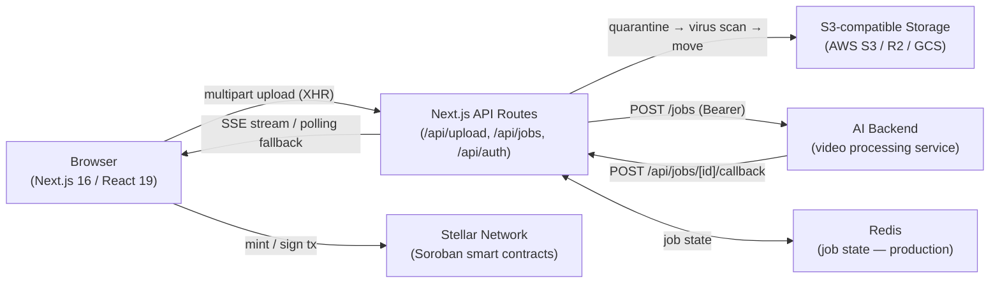

# ClipCash

ClipCash is an AI-powered platform that turns long-form videos into short, platform-ready clips for TikTok, Instagram Reels, YouTube Shorts, and more. Creators preview and select every clip before posting, with optional NFT minting on the Stellar network for true content ownership and on-chain royalties.

## Architecture



For a deep dive into each system — upload quarantine, AES-GCM wallet encryption, JWT session shape, Zustand store layout — see **[docs/ARCHITECTURE.md](docs/ARCHITECTURE.md)**.

For the current security posture, threat model, and reporting process, see **[docs/SECURITY.md](docs/SECURITY.md)**.

---

## Quick Start

```bash
# 1. Clone
git clone https://github.com/ANYTECHS/clips-frontend.git
cd clips-frontend

# 2. Install dependencies
npm install

# 3. Configure environment
cp .env.example .env.local
# Edit .env.local — the minimum required variables are listed below

# 4. Start the development server
npm run dev
```

Open [http://localhost:3000](http://localhost:3000). The app runs fully offline with in-memory job storage and virus scanning disabled in development.

---

## Environment Variables

Copy `.env.example` to `.env.local` and fill in the values. The table below lists every variable; required ones will cause the server to fail or the feature to be silently broken if omitted.

### Auth

| Variable | Required | Description |
|---|---|---|
| `NEXTAUTH_SECRET` | **Yes** | Session signing key. Generate: `openssl rand -base64 32` |
| `NEXTAUTH_URL` | **Yes** | Canonical app URL, e.g. `http://localhost:3000` |
| `GOOGLE_CLIENT_ID` | **Yes** | Google OAuth client ID |
| `GOOGLE_CLIENT_SECRET` | **Yes** | Google OAuth client secret |
| `APPLE_ID` | Optional | Apple Sign-In service ID |
| `APPLE_TEAM_ID` | Optional | Apple developer team ID |
| `APPLE_KEY_ID` | Optional | Apple Sign-In key ID |
| `APPLE_PRIVATE_KEY` | Optional | Apple Sign-In private key (full PEM) |
| `TWITTER_CLIENT_ID` | Optional | Twitter OAuth 2.0 client ID |
| `TWITTER_CLIENT_SECRET` | Optional | Twitter OAuth 2.0 client secret |
| `INSTAGRAM_CLIENT_ID` | Optional | Instagram OAuth client ID |
| `INSTAGRAM_CLIENT_SECRET` | Optional | Instagram OAuth client secret |
| `TIKTOK_CLIENT_KEY` | Optional | TikTok OAuth client key |
| `TIKTOK_CLIENT_SECRET` | Optional | TikTok OAuth client secret |

### AI Backend

| Variable | Required | Description |
|---|---|---|
| `NEXT_PUBLIC_AI_API_URL` | Prod only | Base URL of the AI video processing service. If unset in dev, jobs stay `queued` — no crash. |
| `AI_BACKEND_SECRET` | Prod only | Bearer token sent on outbound dispatches to the AI service |
| `AI_BACKEND_CALLBACK_SECRET` | **Yes (prod)** | Secret the AI service must send when calling `/api/jobs/[id]/callback`. Generate: `openssl rand -hex 32` |
| `NEXT_PUBLIC_API_URL` | Optional | Base URL for the main backend API (user profile, earnings). Defaults to `http://localhost:4000`. |

### Cloud Storage

Files require a valid S3-compatible bucket to upload. In development you can leave these blank — uploads will fail but the rest of the app works.

| Variable | Required | Description |
|---|---|---|
| `CLOUD_STORAGE_BUCKET` | **Yes (prod)** | Bucket name |
| `CLOUD_STORAGE_REGION` | **Yes (prod)** | Region, e.g. `us-east-1`. Use `auto` for Cloudflare R2. |
| `AWS_ACCESS_KEY_ID` | **Yes (prod)** | Access key / account ID |
| `AWS_SECRET_ACCESS_KEY` | **Yes (prod)** | Secret key / API token |
| `CLOUD_STORAGE_PROVIDER` | Optional | `s3` (default) \| `r2` \| `gcs` |
| `CLOUD_STORAGE_ENDPOINT` | Optional | Custom endpoint for R2/GCS S3 interop. Leave blank for AWS S3. |
| `CLOUD_STORAGE_KEY_PREFIX` | Optional | Object key prefix (default: `uploads/`) |

### Redis

| Variable | Required | Description |
|---|---|---|
| `REDIS_URL` | **Yes (prod)** | Redis connection string, e.g. `redis://:password@hostname:6379`. Without this, job state lives in-process — fine for dev, broken on multi-instance deployments. |

### Stellar / Blockchain

| Variable | Required | Description |
|---|---|---|
| `NEXT_PUBLIC_STELLAR_NETWORK` | Optional | `testnet` (default) \| `mainnet` |
| `NEXT_PUBLIC_STELLAR_RPC` | Optional | Custom Soroban RPC URL override |
| `NEXT_PUBLIC_STELLAR_NFT_CONTRACT_ID` | Optional | Soroban NFT contract address (testnet) |
| `NEXT_PUBLIC_STELLAR_NFT_CONTRACT_ID_MAINNET` | Optional | Soroban NFT contract address (mainnet) |

### Virus Scanning

Scanning is **enabled by default in production** and **disabled in development**. If `VIRUS_SCAN_ENABLED` is not set the default applies.

| Variable | Required | Description |
|---|---|---|
| `VIRUS_SCAN_PROVIDER` | Optional | `clamav` (default) \| `virustotal` \| `cloudmersive` \| `disabled` |
| `VIRUS_SCAN_ENABLED` | Optional | `true` \| `false`. Overrides the production/development default. |
| `VIRUS_SCAN_TIMEOUT` | Optional | Scan timeout in ms (default: `30000`) |
| `VIRUS_SCAN_QUARANTINE_PREFIX` | Optional | S3 prefix for pre-scan staging (default: `uploads/quarantine/`) |
| `CLAMAV_API_URL` | Conditional | Required when `VIRUS_SCAN_PROVIDER=clamav`. HTTP endpoint of the ClamAV sidecar, e.g. `http://localhost:8080`. |
| `VIRUSTOTAL_API_KEY` | Conditional | Required when `VIRUS_SCAN_PROVIDER=virustotal` |
| `CLOUDMERSIVE_API_KEY` | Conditional | Required when `VIRUS_SCAN_PROVIDER=cloudmersive` |

### Monitoring & Analytics

| Variable | Required | Description |
|---|---|---|
| `NEXT_PUBLIC_SENTRY_DSN` | Optional | Sentry DSN for error monitoring |
| `NEXT_PUBLIC_ANALYTICS_PROVIDER` | Optional | `none` (default) \| `ga4` \| `plausible` \| `custom` |
| `NEXT_PUBLIC_GA_MEASUREMENT_ID` | Optional | Google Analytics 4 measurement ID (e.g. `G-XXXXXXXXXX`) |
| `NEXT_PUBLIC_PLAUSIBLE_DOMAIN` | Optional | Plausible analytics domain |
| `NEXT_PUBLIC_ANALYTICS_ENDPOINT` | Optional | Custom analytics POST endpoint |

### Social Recovery & Email

| Variable | Required | Description |
|---|---|---|
| `EMAIL_FROM` | Optional | From address for guardian approval emails (default: `noreply@clipcash.ai`) |
| `RESEND_API_KEY` | Optional | [Resend](https://resend.com) API key for transactional email |

### AI Transformation

| Variable | Required | Description |
|---|---|---|
| `NEXT_PUBLIC_TRANSFORM_STYLES` | Optional | Comma-separated list of available styles (default: `anime,cinematic,sketch,watercolor`) |

---

## Development Scripts

| Script | Command | What it does |
|---|---|---|
| Dev server | `npm run dev` | Starts Next.js at [localhost:3000](http://localhost:3000) with hot reload |
| Production build | `npm run build` | Compiles and optimises for production |
| Production server | `npm run start` | Serves the production build |
| Lint | `npm run lint` | Runs ESLint across the codebase |
| Unit tests | `npm run test` | Runs Jest test suite |
| E2E tests | `npm run test:e2e` | Runs Playwright tests against a local dev server (auto-started). Sets `E2E_SKIP_MIDDLEWARE=true` so auth is bypassed. |
| Storybook | `npm run storybook` | Starts Storybook component explorer at [localhost:6006](http://localhost:6006) |
| Build Storybook | `npm run build-storybook` | Builds a static Storybook site |
| Bundle analysis | `npm run analyze` | Builds with `@next/bundle-analyzer` — opens bundle report in browser |
| Changeset | `npm run changeset` | Creates a versioning entry for your PR (see [CONTRIBUTING.md](CONTRIBUTING.md)) |

> **Note:** `npm run test:e2e` automatically starts the Next.js dev server before the test run and reuses an existing server if one is already running. You do not need to run `npm run dev` separately.

---

## Tech Stack

| Layer | Technology | Notes |
|---|---|---|
| Framework | Next.js 16 + React 19 + TypeScript | App Router, Server Components, API Routes |
| Styling | Tailwind CSS 4 | Utility-first; dark theme via CSS variables |
| State | Zustand 5 | Stores for dashboard, earnings, process, transform, user |
| Auth | NextAuth v5 | Google, Apple, Twitter, Instagram, TikTok, WebAuthn passkeys |
| Blockchain | Stellar / Soroban (`@stellar/stellar-sdk`) | Embedded wallet, Freighter extension, NFT minting |
| Storage | AWS S3 / Cloudflare R2 / GCS | S3-compatible via `@aws-sdk/client-s3` |
| Job state | Redis (`ioredis`) / in-process Map | Swappable via `REDIS_URL` |
| Icons | lucide-react | |
| Error monitoring | Sentry | `@sentry/nextjs` |
| Testing | Jest + Playwright | Unit: Jest; E2E: Playwright (Chromium, Firefox, WebKit) |
| Component demos | Storybook 10 | Canonical demo environment — do not add public demo routes |
| Crypto | Web Crypto API | AES-GCM wallet encryption, PBKDF2 key derivation |
| Secret sharing | secrets.js-grempe | Shamir's Secret Sharing for social recovery |

---

## Features

- **AI clip generation** — automatically identifies viral moments in uploaded videos
- **Full preview & selection** — creators see every clip before anything is posted
- **Multi-platform posting** — TikTok, Instagram Reels, YouTube Shorts, Facebook Reels, Snapchat Spotlight, Pinterest, LinkedIn
- **NFT Vault** — mint best clips as Soroban NFTs; earn on-chain royalties
- **Embedded Stellar wallet** — auto-created on signup, encrypted with AES-GCM; no seed phrase required
- **Multi-wallet support** — connect MetaMask (EVM), Phantom (Solana), Freighter (Stellar), or import a Stellar key
- **Social recovery** — Shamir's Secret Sharing splits the wallet secret key across guardian accounts
- **Earnings dashboard** — unified revenue view across platforms with 5-minute cache
- **Real-time progress** — SSE stream with automatic polling fallback while jobs process
- **Push notifications** — browser notifications when a job completes

---

## API Reference

### `POST /api/upload`

Upload one or more video files for AI processing.

- **Content-Type:** `multipart/form-data`
- **Field:** `files` — video file(s), max 500 MB each
- **Formats:** MP4, MOV, AVI, MKV (validated by magic bytes, not just extension)

```json
// 200 OK
{
  "data": {
    "success": true,
    "jobId": "job_abc123",
    "files": [{ "name": "video.mp4", "size": 104857600, "type": "video/mp4", "jobId": "job_abc123", "url": "https://..." }]
  }
}
```

### `GET /api/jobs/:jobId`

Poll for job status (fallback when SSE is unavailable).

```json
{ "progress": 45, "status": "processing", "momentsFound": 3, "estimatedSecondsRemaining": 120 }
```

`status` values: `queued` → `processing` → `complete` | `error`

### `GET /api/jobs/:jobId/stream`

Server-Sent Events stream. Pushes the same shape as the poll endpoint every ~1 s until `status` reaches a terminal state. Requires authentication; the session user must own the job.

---

## Project Structure

```
app/
├── (dashboard)/          # Authenticated dashboard routes (layout.tsx wraps all)
│   ├── dashboard/        # Overview, stats, recent projects
│   ├── earnings/         # Earnings breakdown
│   ├── vault/            # NFT management
│   ├── transform/[id]/   # AI style-transfer job monitor
│   └── …
├── api/                  # API Route handlers
│   ├── upload/           # File ingestion pipeline
│   ├── jobs/             # Job CRUD, SSE stream, AI callback
│   └── auth/             # NextAuth + passkey endpoints
├── hooks/                # React hooks (useProcessingStatus, useBalance, …)
├── lib/                  # Pure utilities (auth, secureStorage, aiBackend, …)
├── store/                # Zustand stores (barrel export at store/index.ts)
└── onboarding/           # 3-step onboarding flow
components/               # Shared React components
docs/
└── ARCHITECTURE.md       # Deep-dive: pipeline, wallet encryption, auth, state
hooks/                    # App-level hooks (useFilterQueryState, …)
tests/e2e/                # Playwright end-to-end tests
stories/                  # Storybook stories
```

---

## Contributing

See **[CONTRIBUTING.md](CONTRIBUTING.md)** for local setup, the Changesets versioning workflow, branch naming conventions, PR checklist, and issue triage guidelines.

Key rules from [AGENTS.md](AGENTS.md):
- All user-controlled strings rendered in the UI must be sanitized with the `sanitize` utility at `app/lib/sanitize.ts`.
- Never use `dangerouslySetInnerHTML` without explicit DOMPurify sanitization.
- Component demos belong in **Storybook**, not in public App Router pages.
