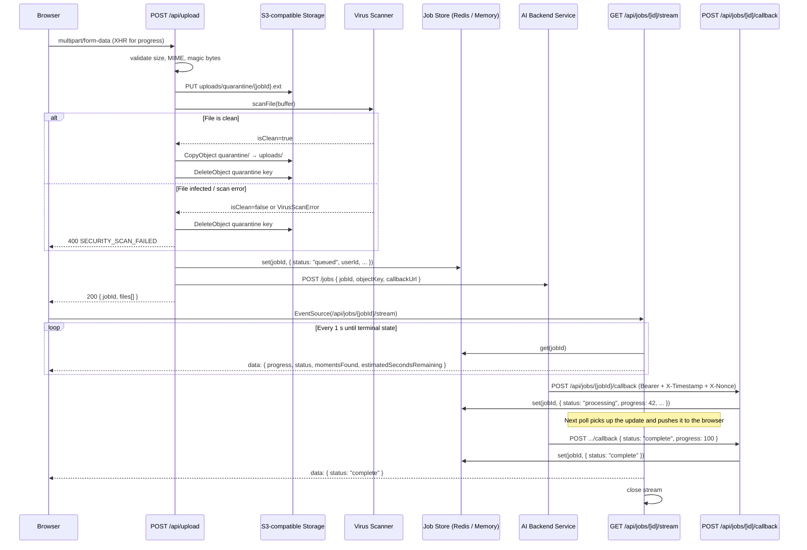
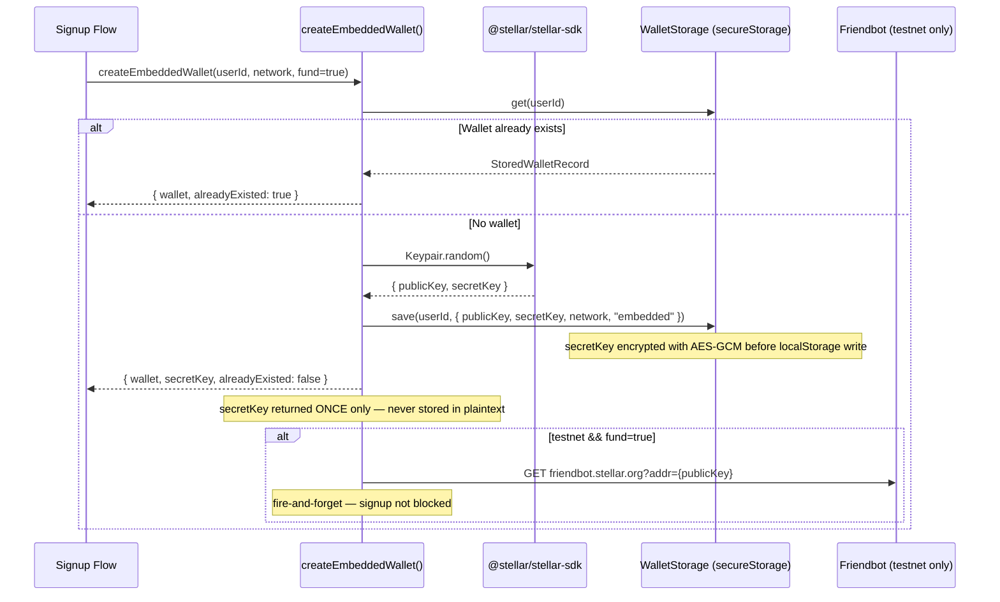
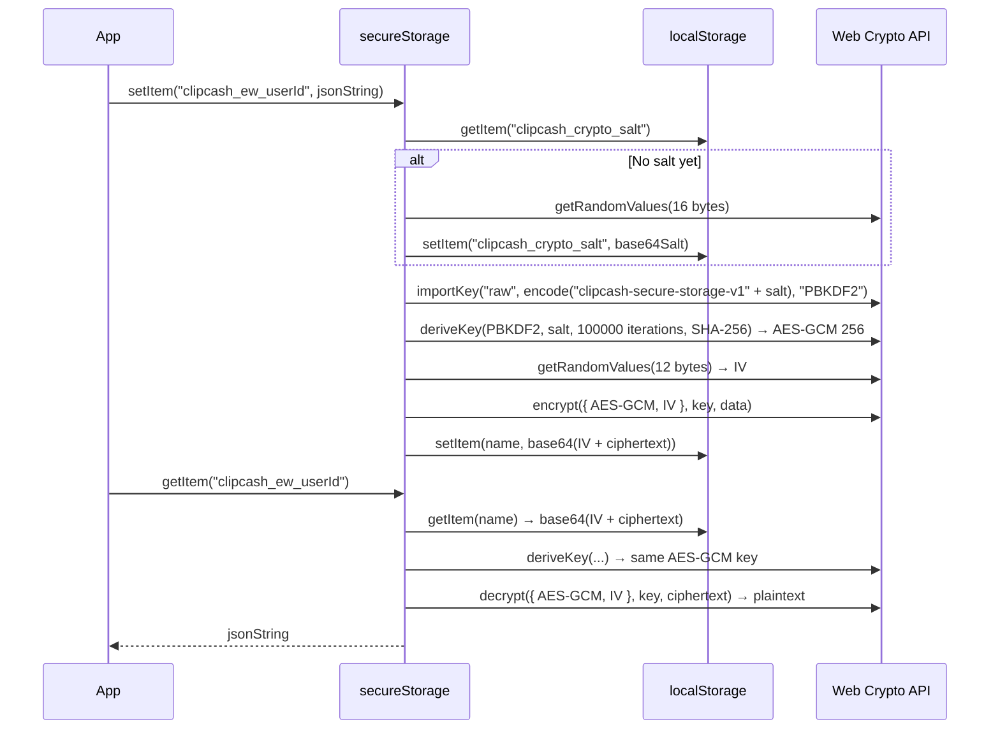
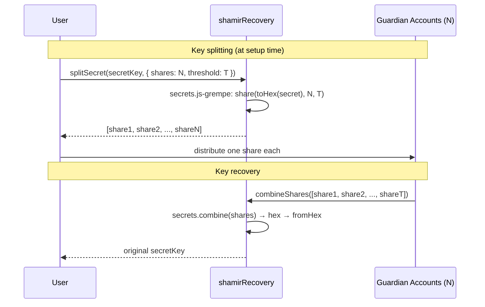
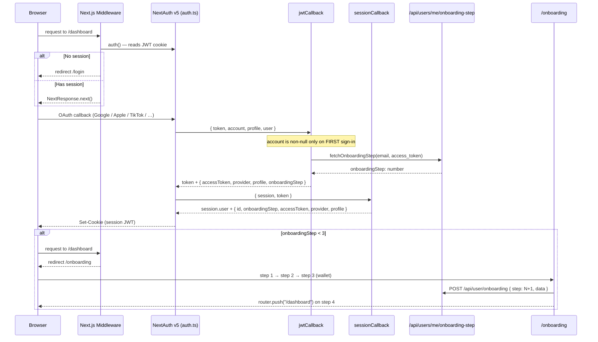

# Architecture

This document explains the non-obvious design decisions in ClipCash. It is aimed at engineers who are new to the codebase and want to understand *why* things are built the way they are, not just *how* they work.

---

## Table of Contents

1. [Job Pipeline](#1-job-pipeline)
2. [Wallet Architecture](#2-wallet-architecture)
3. [Authentication Flow](#3-authentication-flow)
4. [State Management](#4-state-management)
5. [Client vs Server Boundaries](#5-client-vs-server-boundaries)

---

## 1. Job Pipeline 

The pipeline takes a raw video upload and asynchronously produces AI-generated clip moments, streaming progress back to the browser in real time.

### 1.1 Overview



### 1.2 Upload & Quarantine (`app/api/upload/route.ts`, `app/lib/cloudStorage.ts`)

Every upload goes through these steps in order:

| Step | What happens | Where |
|------|-------------|-------|
| 1 | Rate limit (20 req / 60 s per IP) | `applyRateLimit()` in upload route |
| 2 | CSRF check | `app/lib/csrf.ts` |
| 3 | Auth — session must have a `userId` | NextAuth `auth()` |
| 4 | File validation — size ≤ 500 MB, MIME/extension whitelist | `validateFile()` |
| 5 | **Magic-byte inspection** — reads first 12 bytes to verify actual video format | `validateMagicBytes()` |
| 6 | Upload to quarantine prefix (`uploads/quarantine/{jobId}.ext`) | `uploadToQuarantine()` |
| 7 | Virus scan | `scanFile()` in `app/lib/virusScan.ts` |
| 8 | On clean: S3 `CopyObject` → `uploads/{jobId}.ext`, then `DeleteObject` quarantine | `moveFromQuarantine()` |
| 9 | Register job in store as `"queued"` | `jobStore.set()` |
| 10 | Dispatch to AI backend (non-blocking) | `dispatchJob()` in `app/lib/aiBackend.ts` |

**Why magic-byte inspection?** Extension and MIME type are attacker-controlled. Reading the actual file header ensures malware cannot masquerade as a video by renaming itself `exploit.mp4`.

**Why quarantine?** Files are staged separately before scanning. If the scan fails or times out the quarantined file is deleted before any processing starts, so infected bytes never reach the AI pipeline.

**Why multipart S3?** Files larger than 50 MB are uploaded using S3 multipart (10 MB parts, max 5 concurrent parts). This avoids Lambda/edge timeout limits and improves reliability for large videos.

### 1.3 Virus Scanning (`app/lib/virusScan.ts`)

Controlled by `VIRUS_SCAN_PROVIDER` (default: `"clamav"`):

| Provider | Notes |
|----------|-------|
| `clamav` | POST raw buffer to `CLAMAV_API_URL/scan`. Fastest for self-hosted. |
| `virustotal` | Multipart upload, then polls analysis result up to 3 times with exponential backoff. |
| `cloudmersive` | Multipart upload, synchronous result. |
| `disabled` | Always returns `isClean: true`. Development only. |

`VIRUS_SCAN_ENABLED` defaults to `true` in production, `false` in development. Timeout is 30 s (`VIRUS_SCAN_DEFAULT_TIMEOUT_MS`).

### 1.4 Job Store — in-process vs Redis (`app/api/jobs/shared/`)

```
jobStore (JobStore interface)
  └─ JobRepositoryAdapter
       └─ JobRepository
            ├─ RedisStorageAdapter  (REDIS_URL is set)
            └─ InMemoryStorageAdapter  (fallback / test)
```

**Why is the default in-process?** This removes the Redis dependency entirely for local development. The interface is the same either way, so swapping to Redis in production requires only setting `REDIS_URL`.

**Caveat:** In-process state is not shared across serverless function instances. On Vercel or any platform that spins up multiple instances, `REDIS_URL` **must** be set. The store logs a warning at startup if running in production without it.

Job shape:
```ts
interface Job {
  id: string;
  userId: string;                          // owner – used for auth
  status: "queued" | "processing" | "complete" | "error";
  progress: number;                        // 0–100
  momentsFound: number;
  estimatedSecondsRemaining: number;
  createdAt: number;                       // Unix ms
  errorCode?: "UNSUPPORTED_CODEC" | "VIDEO_TOO_SHORT" | "VIDEO_TOO_LONG"
             | "PROCESSING_TIMEOUT" | "INTERNAL_ERROR";
  errorMessage?: string;
}
```

### 1.5 AI Callback (`app/api/jobs/[id]/callback/route.ts`)

The AI backend is the **only** writer of job status. The SSE stream reads whatever the callback has written.

Security on the callback endpoint:
- **Bearer token** — `Authorization: Bearer {AI_BACKEND_CALLBACK_SECRET}`. Missing secret in production → 401 for all requests.
- **Timestamp tolerance** — `X-Timestamp` header must be within ±60 s of server clock.
- **Nonce deduplication** — `X-Nonce` (UUID) is recorded in `nonceCache` for 2 minutes; replayed nonces are rejected with 401.
- **Terminal state guard** — updates to jobs already in `complete` or `error` are silently ignored with HTTP 200.

### 1.6 SSE Stream — SSE first, polling fallback (`app/api/jobs/[id]/stream/route.ts`, `app/hooks/useProcessingStatus.ts`)

**Why SSE instead of WebSockets?** SSE is simpler, uses plain HTTP, works through proxies, and is sufficient for unidirectional server→client progress updates.

**Why polling fallback?** `EventSource` reconnects are not always reliable across all browsers and proxies (especially behind Vercel edge). After 3 failed reconnect attempts (exponential backoff: 1 s, 2 s, 4 s) the hook degrades to HTTP polling every 3 s.

```
Browser
  │
  ├─ EventSource → /api/jobs/{id}/stream ─ polls jobStore every 1 s
  │                                         closes on terminal state
  │
  │  (on 3rd SSE error)
  └─ setInterval(fetchStatus, 3000) → GET /api/jobs/{id}
```

The server-side stream sends an immediate snapshot on connection (no waiting for the first poll interval) and sets `X-Accel-Buffering: no` to prevent Vercel/nginx from buffering the SSE frames.

### 1.7 Upload Progress (`app/hooks/useUploadProgress.ts`)

Uses `XMLHttpRequest` instead of `fetch` because `fetch` does not expose upload progress events. `xhr.upload.onprogress` provides per-file byte-level progress. All files in a batch are uploaded in parallel via `Promise.allSettled`.

---

## 2. Wallet Architecture

ClipCash supports five wallet types across two blockchains. The embedded Stellar wallet is the default and requires no crypto knowledge from the user.

### 2.1 Wallet Types

| Type | Chain | How connected | Secret storage |
|------|-------|---------------|----------------|
| `embedded` | Stellar | Auto-created on signup | AES-GCM in localStorage via `secureStorage` |
| `freighter` | Stellar | Browser extension (`window.freighter`) | Stays in extension |
| `imported` | Stellar | User pastes secret key | `btoa`-encoded in `multiWalletStorage` |
| `metamask` | EVM | Browser extension (`window.ethereum`) | Stays in MetaMask |
| `phantom` | Solana | Browser extension (`window.solana`) | Stays in Phantom |

### 2.2 Embedded Wallet Creation (`app/lib/embeddedWallet.ts`)



The raw `secretKey` is returned exactly once at creation time. After that, it is only readable via `WalletStorage.getSecretKey(userId)` which decrypts from `secureStorage`.

### 2.3 Secure Storage — AES-GCM encrypted localStorage (`app/lib/secureStorage.ts`)

All sensitive wallet data at rest is encrypted with AES-GCM 256-bit using a browser-derived key.



**Key derivation details:**
- Salt: 16 random bytes, stored in `localStorage["clipcash_crypto_salt"]`, persisted across sessions.
- Password material: static string `"clipcash-secure-storage-v1"` concatenated with the salt — not a user password. This means the key is device-bound, not password-protected.
- PBKDF2: 100,000 iterations with SHA-256 (constant `PBKDF2_ITERATIONS`).
- Encryption: AES-GCM 256-bit with a fresh random 12-byte IV per write.
- Output: `base64(IV[12] || ciphertext)`.

**Salt migration:** On old builds, the salt was stored in `sessionStorage`. `migrateCryptoSalt()` (called at startup in `layout.tsx`) moves it to `localStorage` for persistence. It is also called inside `getCryptoKey()` as a safeguard.

**Decryption failure handling:** If decryption fails (e.g. salt was regenerated), `getItem` returns `null` and sets `pendingDecryptionWarning`. The UI can surface this via `getSecureStorageWarning()`.

### 2.4 Key Derivation for Password-Protected Exports (`app/lib/cryptoUtils.ts`)

When a user exports their secret key protected by a custom password, a separate PBKDF2 derivation is used:

- Salt: 16 random bytes included in the output blob (not stored separately).
- IV: 12 random bytes included in the output blob.
- Output: `base64(salt[16] || IV[12] || ciphertext)` — self-contained and portable.
- This is distinct from `secureStorage`'s device-bound key.

### 2.5 Social Recovery — Shamir's Secret Sharing (`app/lib/shamirRecovery.ts`)



`defaultRecoveryThreshold(guardianCount)` returns `ceil(guardianCount × 2/3)`, minimum 2. The threshold and guardian count are stored on the `User` object as `socialRecoveryThreshold` and `socialRecoveryGuardianCount`.

### 2.6 Multi-Wallet Provider (`app/lib/multiWalletStorage.ts`, `app/hooks/useMultiWalletConnection.ts`)

The multi-wallet layer allows a single user to manage multiple connected wallets simultaneously.

Storage key: `clipcash_multi_wallets_{userId}` — plain JSON array in `localStorage` (no AES-GCM encryption; secrets for non-embedded wallets are stored as `btoa(secret)` only).

**Race-condition fix (#514):** The `connectMetaMask/Phantom/Stellar()` methods in `WalletProvider` now return the connected address directly from their promise. `useMultiWalletConnection` reads this return value. If it is `null` (older build or edge-case error path), it falls back to polling `wallet.address` from React context every 50 ms up to 20 times (1 s total) before giving up.

### 2.7 localStorage Key Map

| Key | Purpose | Encrypted |
|-----|---------|-----------|
| `clipcash_crypto_salt` | PBKDF2 salt for AES-GCM key derivation | No — required to derive the key |
| `clipcash_ew_{userId}` | Embedded wallet record (includes secret key) | **Yes** — AES-GCM via `secureStorage` |
| `clipcash_multi_wallets_{userId}` | Multi-wallet array | No — secrets `btoa`-encoded only |
| `clipcash_wallet` | Active `WalletProvider` session (address, chainId, type) | **Yes** — AES-GCM via `secureStorage` |
| `clipcash_passkey_id` | Last WebAuthn credential ID | No |
| `clips_process_state` | Active processing job state (Zustand) | **Yes** — AES-GCM via `secureStorage` |
| `clips_transform_state` | AI transform jobs (Zustand) | **Yes** — AES-GCM via `secureStorage` |

---

## 3. Authentication Flow

### 3.1 Overview



### 3.2 NextAuth v5 Configuration (`app/lib/auth.ts`)

This codebase uses **NextAuth v5** (`next-auth@^5`). The key breaking changes from v4 are:

- Config type is `NextAuthConfig` (was `NextAuthOptions`).
- Named default imports: `Google`, `Apple`, `Twitter`, `Instagram` (were `GoogleProvider`, etc.).
- Route handler: `export const { GET, POST } = handlers` in `app/api/auth/[...nextauth]/route.ts`.
- Server-side session: `auth()` (was `getServerSession(authOptions)`).

Configured providers:

| Provider | Notes |
|----------|-------|
| Google | Scope includes `youtube.readonly` for clip importing |
| Apple | Full Apple Sign-In credentials (team ID, key ID, private key) |
| Twitter | OAuth 2.0 |
| Instagram | OAuth |
| TikTok | Custom OAuth 2.0 with manual `authorization`, `token`, `userinfo` URLs |
| Credentials (`"recovery"`) | Stellar public key + signature; rate-limited 5 attempts → 15 min lockout by IP |

### 3.3 JWT Extensions

The JWT stored in the session cookie is extended with:

```ts
token.accessToken   // OAuth provider access token
token.provider      // "google" | "apple" | "twitter" | ...
token.profile       // Raw OAuth provider profile object
token.onboardingStep // number — fetched once at sign-in, then carried in JWT
```

`onboardingStep` is fetched from the backend API **only once** on initial sign-in (when `account` is non-null in `jwtCallback`). Subsequent session reads use the value from the JWT, avoiding a backend round-trip on every request.

### 3.4 Session Shape

```ts
session.user = {
  id: string;               // token.sub (provider user ID)
  name: string;
  email: string;
  image: string;
  onboardingStep: number;   // 0=default, 1=profile, 2=socials, 3+=complete
  accessToken?: string;     // OAuth access token
  provider?: string;        // provider id
  profile?: Profile;        // raw provider profile
}
```

### 3.5 Onboarding Step Routing

`onboardingStep` controls where users land after sign-in:

| Step | Meaning | Where middleware sends the user |
|------|---------|--------------------------------|
| 0 | Default / unknown | `/dashboard` |
| 1 | Profile not complete | `/onboarding` (step 1: name/username/bio/niche) |
| 2 | Socials not connected | `/onboarding` (step 2: TikTok/Instagram/YouTube handles) |
| 3 | Wallet not acknowledged | `/onboarding` (step 3: wallet awareness screen) |
| 4+ | Fully onboarded | `/dashboard` |

Both `middleware.ts` (server-side, edge) and `app/lib/authRedirect.ts` (client-side, used in `AuthProvider`) implement the same routing logic:

- Unauthenticated + protected route → `/login`
- Authenticated + auth/root route → `/onboarding` (steps 1–2) or `/dashboard` (step 3+)
- Authenticated + `/onboarding` + step > 2 → `/dashboard`

`E2E_SKIP_MIDDLEWARE=true` bypasses the middleware entirely for Playwright tests.

### 3.6 Middleware Architecture

```
middleware.ts
  │
  ├─ E2E_SKIP_MIDDLEWARE=true → NextResponse.next() (Playwright bypass)
  │
  └─ getAuthMiddleware() — lazy-loads NextAuth auth() wrapper, cached after first call
       │
       └─ auth(request => {
            reads session.user.onboardingStep
            getRedirectTarget(pathname, hasToken, onboardingStep)
            → NextResponse.redirect | NextResponse.next
          })
```

The lazy-load pattern prevents importing `app/lib/auth.ts` (and its heavy OAuth dependencies) at cold-start time on routes that will never need it.

---

## 4. State Management

### 4.1 Strategy

| Data type | Where it lives | Why |
|-----------|---------------|-----|
| Server/API data (dashboard stats, earnings) | Zustand (`useDashboardStore`, `useEarningsStore`) | Cached, shared across components, invalidated on plan change |
| Current user profile | Zustand (`useUserStore`) | Shared everywhere, needs plan-change subscription |
| Active processing job | Zustand (`useProcessStore`) + `secureStorage` | Must survive page reload mid-upload |
| AI transform jobs | Zustand (`useTransformStore`) + `secureStorage` | Must survive page reload mid-transform |
| Filter/sort state on list pages | URL query params via `useFilterQueryState` | Shareable URLs, survives navigation |
| Wallet connection session | `secureStorage["clipcash_wallet"]` | AES-GCM encrypted; persisted across tabs/reloads |
| In-flight XHR progress | React `useState` in `useUploadProgress` | Component-local, no persistence needed |

### 4.2 Zustand Stores

All stores live under `app/store/` and are exported from the barrel `app/store/index.ts`.

```
app/store/
├── index.ts           ← barrel — import everything from here
├── types.ts           ← shared types only, no logic
├── dashboardStore.ts
├── earningsStore.ts
├── processStore.ts    ← persisted to secureStorage
├── transformStore.ts  ← persisted to secureStorage
└── userStore.ts
```

**Fine-grained selectors** — every store exposes named selectors (`selectStats`, `selectUserName`, etc.) so components subscribe to only the slice of state they use:

```ts
const stats = useDashboardStore(selectStats);       // re-renders only when stats changes
const name  = useUserStore(selectUserName);          // re-renders only when name changes
```

**5-minute cache** — `dashboardStore` and `earningsStore` skip the API call if `Date.now() - lastFetchedAt < 5 * 60 * 1000`. They guard against duplicate in-flight requests with `if (loading) return`.

**Plan-change invalidation** — both stores subscribe to `useUserStore.onPlanChange()` at module load time. When the user upgrades/downgrades their plan, both caches are invalidated so the next render fetches fresh data.

### 4.3 Persisted Stores — secureStorage Hydration Pattern

`processStore` and `transformStore` both persist to `secureStorage` (AES-GCM encrypted localStorage). Since `secureStorage` is fully async, a special hydration pattern is used:

```ts
persist(
  (set) => ({ ...state, hasHydrated: false }),
  {
    storage: createJSONStorage(() => secureStorage),
    skipHydration: true,           // don't attempt sync read at store creation
    onRehydrateStorage: () => (_state, error) => {
      if (!error) useProcessStore.setState({ hasHydrated: true });
    },
  }
)

// Trigger async hydration after module load (browser only)
if (typeof window !== 'undefined') {
  useProcessStore.persist.rehydrate();
}
```

Components that depend on persisted data gate rendering behind `hasHydrated`:

```ts
const hasHydrated = useProcessStore(selectHasHydrated);
if (!hasHydrated) return <LoadingSkeleton />;
```

### 4.4 URL State — Filters and Sorts (`hooks/useFilterQueryState.ts`)

Filter state on list pages lives in the URL, not in Zustand. This makes filtered views shareable and preserves state across browser navigation.

```mermaid
sequenceDiagram
    participant Component
    participant Hook as useFilterQueryState(defaults)
    participant URL as URL Query Params

    Component->>Hook: updateFilters({ style: "anime", virality: ["high"] })
    Hook->>URL: router.push(?style=anime&virality=high, { scroll: false })
    Note over URL: arrays → comma-separated; default values → param removed
    URL-->>Hook: useSearchParams() re-reads on next render
    Hook-->>Component: { filters: { style: "anime", virality: ["high"] } }

    Component->>Hook: resetFilters()
    Hook->>URL: router.push(pathname) — clears all params
```

Supported value types: `string`, `number`, `boolean`, `string[]` (comma-separated in URL).
Values that match the default are removed from the URL to keep it clean.

### 4.5 Store Interaction Diagram

```mermaid
graph TD
    UserStore[useUserStore] -->|onPlanChange| DashboardStore[useDashboardStore]
    UserStore -->|onPlanChange| EarningsStore[useEarningsStore]

    ProcessStore[useProcessStore\nclips_process_state\nAES-GCM] -->|progress/status| ProcessingPage[/dashboard/processing]
    TransformStore[useTransformStore\nclips_transform_state\nAES-GCM] -->|jobs| TransformPage[/dashboard/transform/id]

    DashboardStore -->|stats, trend, projects| DashboardPage[/dashboard]
    EarningsStore -->|totals, breakdown| EarningsPage[/earnings]
    UserStore -->|profile, plan| Sidebar & DashboardHeader

    SSE[useProcessingStatus\nSSE → polling fallback] -->|update| ProcessStore
```

---

## 5. Client vs Server Boundaries

Next.js 13+ App Router uses the App Router model where components are server components by default. This enables better performance through server-side rendering and reduced client bundle sizes.

### 5.1 When to Use "use client"

The `"use client"` directive marks a component or module as client-side, meaning it will be rendered in the browser and can use:

- React hooks (`useState`, `useEffect`, `useCallback`, etc.)
- Browser APIs (`window`, `localStorage`, `navigator`, etc.)
- Event handlers (`onClick`, `onChange`, etc.)
- Next.js client-side hooks (`usePathname`, `useSearchParams`, `useRouter`)

**Use cases for "use client":**
- Interactive UI components (buttons, forms, modals)
- Components that use browser storage (localStorage, sessionStorage)
- Components that need to listen to browser events (resize, scroll, storage)
- Context providers that manage client-side state
- Hooks that use React hooks or browser APIs
- Components that use third-party libraries requiring browser environment

**Examples in this codebase:**
- `app/context/NetworkContext.tsx` - Uses localStorage and window events
- `app/components/AnalyticsProvider.tsx` - Uses usePathname and useSearchParams
- `app/lib/notifications.ts` - Uses Notification API and localStorage
- All hooks in `app/hooks/` - Use React hooks for state management
- Dashboard pages - Interactive UI with state and event handlers

### 5.2 When to Use "server-only"

The `"server-only"` import marks a module as server-side only. If imported in a client component, Next.js will throw a build error. This prevents accidentally bundling server-only code in the client.

**Use cases for "server-only":**
- Modules that use Node.js-only APIs (fs, path, crypto, etc.)
- Modules with sensitive server-side logic
- Database access layers
- Server-side utilities that should never run in the browser

**Note:** This codebase currently does not have modules marked with `"server-only"` because most server-side code lives in API routes (which are inherently server-side) and utility modules are designed to work in both environments when possible.

### 5.3 Best Practices

**Default to server components:**
- Start with server components for better performance
- Only add `"use client"` when you need browser-specific features
- Keep client components as small as possible and push logic to server components

**Minimize client bundle:**
- Avoid importing large libraries in client components unless necessary
- Use dynamic imports for client-side only libraries
- Keep utility functions server-side when possible

**Type safety:**
- TypeScript will help catch some issues, but runtime errors can still occur
- Test both server and client rendering paths
- Be aware of environment-specific APIs

**Example pattern:**
```typescript
// ❌ Bad - entire component is client-side
"use client";
export default function Page() {
  const [data, setData] = useState(null);
  // ... lots of logic
}

// ✅ Better - split into server and client parts
export default function Page() {
  const data = await fetchData(); // Server-side
  return <ClientComponent data={data} />;
}

"use client";
function ClientComponent({ data }) {
  const [state, setState] = useState(null);
  // Only client-side logic here
}
```
