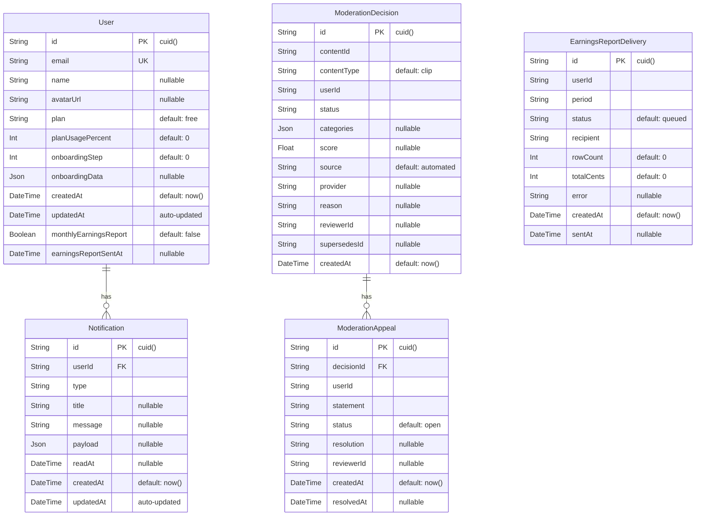

# Database Schema Documentation

This document is the authoritative reference for the Clips database schema. It covers all tables, their columns, indexes, relationships, migration history, and the process for making schema changes.

**Database engine:** PostgreSQL  
**ORM:** Prisma v6.1.0  
**Schema file:** [`prisma/schema.prisma`](../prisma/schema.prisma)  
**Migrations directory:** [`prisma/migrations/`](../prisma/migrations/)

---

## Table of Contents

1. [ER Diagram](#er-diagram)
2. [Tables](#tables)
   - [User](#user)
   - [Notification](#notification)
   - [ModerationDecision](#moderationdecision)
   - [ModerationAppeal](#moderationappeal)
   - [EarningsReportDelivery](#earningsreportdelivery)
3. [Relationships](#relationships)
4. [Indexes](#indexes)
5. [Migration History](#migration-history)
6. [Schema Change Process](#schema-change-process)

---

## ER Diagram

The diagram uses Prisma/PostgreSQL column types. All primary keys are CUIDs generated at the application layer.



### Relationship Summary

| From | Cardinality | To | Via |
|---|---|---|---|
| `User` | one-to-many | `Notification` | `Notification.userId → User.id` |
| `ModerationDecision` | one-to-many | `ModerationAppeal` | `ModerationAppeal.decisionId → ModerationDecision.id` |

`EarningsReportDelivery` has no foreign key constraints — `userId` is a logical reference to `User.id` but is not enforced at the database level, giving the delivery log table independence from user lifecycle events.

`ModerationDecision.supersedesId` is a self-referencing logical link (not a Prisma relation) that chains decisions into an audit trail.

---

## Tables

### User

Stores every registered creator account.

| Column | Type | Nullable | Default | Description |
|---|---|---|---|---|
| `id` | `String` | No | `cuid()` | Primary key. CUID generated by Prisma. |
| `email` | `String` | No | — | Unique email address used for login and notifications. |
| `name` | `String` | Yes | — | Display name. |
| `avatarUrl` | `String` | Yes | — | URL to the user's avatar image. |
| `plan` | `String` | No | `"free"` | Subscription tier. Known values: `free`, `pro`, `enterprise`. |
| `planUsagePercent` | `Int` | No | `0` | Percentage of plan quota consumed (0–100). |
| `onboardingStep` | `Int` | No | `0` | Current step in the onboarding flow. `0` = not started. |
| `onboardingData` | `Json` | Yes | — | Arbitrary JSON bag persisting onboarding tutorial state. |
| `createdAt` | `DateTime` | No | `now()` | Row creation timestamp. |
| `updatedAt` | `DateTime` | No | — | Automatically updated on every write by Prisma (`@updatedAt`). |
| `monthlyEarningsReport` | `Boolean` | No | `false` | Opt-in flag for the monthly earnings report email. Opt-in (not opt-out) because the report contains a full transaction export. See [Issue #820](../docs/EARNINGS_REPORT_EMAIL.md). |
| `earningsReportSentAt` | `DateTime` | Yes | — | Timestamp of the last successful earnings report delivery. Used by the monthly cron to skip duplicate sends within the same period. |

**Constraints:**
- `id` — primary key
- `email` — unique index (`User_email_key`)

**Relations:**
- `notifications Notification[]` — one user has zero or many notifications (cascade delete)

---

### Notification

Persists in-app notifications delivered to creators.

| Column | Type | Nullable | Default | Description |
|---|---|---|---|---|
| `id` | `String` | No | `cuid()` | Primary key. |
| `userId` | `String` | No | — | Foreign key → `User.id`. Identifies the recipient. |
| `type` | `String` | No | — | Event type. Known values: `job_complete`, `transform_complete`, `mint_success`, `earnings_received`. |
| `title` | `String` | Yes | — | Short heading shown in the notification panel. |
| `message` | `String` | Yes | — | Human-readable body text. |
| `payload` | `Json` | Yes | — | Structured data specific to the notification type (e.g., job ID, amount). |
| `readAt` | `DateTime` | Yes | — | Timestamp when the user marked the notification as read. `NULL` means unread. |
| `createdAt` | `DateTime` | No | `now()` | Row creation timestamp. |
| `updatedAt` | `DateTime` | No | — | Automatically updated by Prisma (`@updatedAt`). |

**Constraints:**
- `id` — primary key
- `userId` — foreign key to `User.id` with `onDelete: Cascade` (notifications are deleted when their user is deleted)

**Indexes:** see [Indexes](#indexes) section.

---

### ModerationDecision

Records the outcome of a moderation check on a piece of content.

> **Append-only design:** rows are never updated in place once a decision is final. A review or appeal creates a new row with `supersedesId` pointing to the previous decision, so the full decision chain remains reconstructable. See [Issue #1063](../docs/ISSUES_1060_1061_1062_1064.md).

| Column | Type | Nullable | Default | Description |
|---|---|---|---|---|
| `id` | `String` | No | `cuid()` | Primary key. |
| `contentId` | `String` | No | — | Identifier of the content item in the clips backend service. |
| `contentType` | `String` | No | `"clip"` | Kind of content. Values: `clip`, `caption`, `thumbnail`. |
| `userId` | `String` | No | — | Creator who owns the content being reviewed. |
| `status` | `String` | No | — | Decision outcome. Values: `pending`, `approved`, `flagged`, `rejected`. |
| `categories` | `Json` | Yes | — | Object mapping policy category names to confidence scores, produced by the automated provider. |
| `score` | `Float` | Yes | — | Overall 0–1 confidence score from the automated provider. `NULL` for human decisions. |
| `source` | `String` | No | `"automated"` | How the decision was made. Values: `automated`, `manual`, `appeal`. |
| `provider` | `String` | Yes | — | Name of the automated moderation provider (for auditability). `NULL` for human decisions. |
| `reason` | `String` | Yes | — | Reviewer note or provider reason string shown in the audit log. |
| `reviewerId` | `String` | Yes | — | ID of the human reviewer who made or overrode the decision. |
| `supersedesId` | `String` | Yes | — | Logical link to the `ModerationDecision.id` this row supersedes, forming the audit chain. Not a Prisma relation — no FK constraint. |
| `createdAt` | `DateTime` | No | `now()` | Row creation timestamp. |

**Relations:**
- `appeals ModerationAppeal[]` — one decision may receive zero or many appeals (cascade delete)

**Indexes:** see [Indexes](#indexes) section.

---

### ModerationAppeal

Stores a creator's formal challenge to a moderation decision.

| Column | Type | Nullable | Default | Description |
|---|---|---|---|---|
| `id` | `String` | No | `cuid()` | Primary key. |
| `decisionId` | `String` | No | — | Foreign key → `ModerationDecision.id`. |
| `userId` | `String` | No | — | Creator filing the appeal. |
| `statement` | `String` | No | — | The creator's argument in their own words. |
| `status` | `String` | No | `"open"` | Appeal state. Values: `open`, `upheld`, `overturned`. |
| `resolution` | `String` | Yes | — | Reviewer's response, shown back to the creator after the appeal is resolved. |
| `reviewerId` | `String` | Yes | — | ID of the reviewer who handled the appeal. |
| `createdAt` | `DateTime` | No | `now()` | Row creation timestamp. |
| `resolvedAt` | `DateTime` | Yes | — | Timestamp when the appeal was closed. `NULL` while `status = open`. |

**Constraints:**
- `decisionId` — foreign key to `ModerationDecision.id` with `onDelete: Cascade`

**Indexes:** see [Indexes](#indexes) section.

---

### EarningsReportDelivery

Idempotency log for the monthly earnings report email cron job.

> The unique constraint on `(userId, period)` ensures a creator never receives duplicate emails for the same month, even if Vercel Cron delivers the trigger at least once. A second run for the same pair is a no-op. See [Issue #820](../docs/EARNINGS_REPORT_EMAIL.md).

| Column | Type | Nullable | Default | Description |
|---|---|---|---|---|
| `id` | `String` | No | `cuid()` | Primary key. |
| `userId` | `String` | No | — | Logical reference to the creator (not a FK constraint). |
| `period` | `String` | No | — | Reported month in `YYYY-MM` format (e.g., `2026-09`). |
| `status` | `String` | No | `"queued"` | Delivery state. Values: `queued`, `sent`, `failed`, `skipped`. |
| `recipient` | `String` | No | — | Email address the report was (or will be) sent to. |
| `rowCount` | `Int` | No | `0` | Number of transaction rows included in the report. |
| `totalCents` | `Int` | No | `0` | Sum of earnings in the reported period, stored in cents to avoid floating-point rounding. |
| `error` | `String` | Yes | — | Error message when `status = failed`. |
| `createdAt` | `DateTime` | No | `now()` | Row creation timestamp. |
| `sentAt` | `DateTime` | Yes | — | Timestamp of successful delivery. `NULL` until `status = sent`. |

**Constraints:**
- `@@unique([userId, period])` — composite unique index (`EarningsReportDelivery_userId_period_key`). The primary idempotency guard.

**Indexes:** see [Indexes](#indexes) section.

---

## Relationships

### User → Notification (one-to-many)

```
User.id ──< Notification.userId
```

- One user can have zero or many notifications.
- `onDelete: Cascade` — deleting a user removes all their notifications.
- Notification queries always filter by `userId` first; the composite indexes on `Notification` make this efficient.

### ModerationDecision → ModerationAppeal (one-to-many)

```
ModerationDecision.id ──< ModerationAppeal.decisionId
```

- One decision can receive zero or many appeals (though in practice one appeal per decision is the intended flow).
- `onDelete: Cascade` — deleting a decision removes all its appeals.
- Appeals are only meaningful in the context of the decision being challenged.

### ModerationDecision → ModerationDecision (self-referencing audit chain)

```
ModerationDecision.supersedesId ──> ModerationDecision.id
```

- This is a **logical link only** — there is no Prisma `@relation` and no database FK constraint.
- The chain is intentionally not enforced at the DB level to allow the superseded row to be archived or purged independently without breaking the newer row.
- Walk the chain by querying `WHERE id = <supersedesId>` iteratively.

### EarningsReportDelivery → User (logical reference)

```
EarningsReportDelivery.userId ─ · · ─> User.id
```

- Intentionally unconstrained — no FK. The delivery log is an audit/idempotency record and must survive user deletion without cascading.

---

## Indexes

All indexes are defined in `prisma/schema.prisma` and created by Prisma migrations.

### Notification

| Index name | Columns | Type | Purpose |
|---|---|---|---|
| `Notification_userId_readAt_createdAt_idx` | `(userId, readAt, createdAt)` | Composite B-tree | Optimises the primary notification list query: filter by user, unread state (`readAt IS NULL`), ordered newest-first. |
| `Notification_userId_createdAt_idx` | `(userId, createdAt)` | Composite B-tree | Fallback for queries that do not filter on read state (e.g. "all notifications for this user"). |

Both indexes were added in migration `20260925000000_add_notification_indexes`. See [Database Query Optimization](DATABASE_QUERY_OPTIMIZATION.md) for query patterns these support.

### ModerationDecision

| Index name | Columns | Type | Purpose |
|---|---|---|---|
| `ModerationDecision_contentId_idx` | `(contentId)` | B-tree | Fast lookup of all decisions for a given content item. |
| `ModerationDecision_status_createdAt_idx` | `(status, createdAt)` | Composite B-tree | Admin dashboard queries filtering by status and ordering by date. |
| `ModerationDecision_userId_idx` | `(userId)` | B-tree | Fast lookup of all decisions relating to a creator's content. |

### ModerationAppeal

| Index name | Columns | Type | Purpose |
|---|---|---|---|
| `ModerationAppeal_status_createdAt_idx` | `(status, createdAt)` | Composite B-tree | Admin review queue: filter open appeals, ordered by age. |
| `ModerationAppeal_userId_idx` | `(userId)` | B-tree | Fast lookup of all appeals filed by a creator. |

### EarningsReportDelivery

| Index name | Columns | Type | Purpose |
|---|---|---|---|
| `EarningsReportDelivery_userId_period_key` | `(userId, period)` | Unique B-tree | Idempotency constraint. Also the primary access pattern: fetch the delivery record for a specific user+month before sending. |
| `EarningsReportDelivery_period_idx` | `(period)` | B-tree | Cron job query: find all users to process for a given month. |

### User

| Index name | Columns | Type | Purpose |
|---|---|---|---|
| `User_email_key` | `(email)` | Unique B-tree | Login lookup and uniqueness enforcement. |

### Index Design Guidelines

When adding new list endpoints backed by Prisma:

1. Identify the mandatory filter columns (usually `userId` or a foreign key) — put them first in the index.
2. If the query has an optional filter (like `readAt IS NULL`), add it second.
3. Put the sort column (usually `createdAt`) last.
4. Validate with `npm run complexity` and `COMPLEXITY_STRICT=true` to surface slow-query warnings before merging.

---

## Migration History

Migrations live in `prisma/migrations/`. Each directory name encodes the timestamp and a descriptive slug: `YYYYMMDDHHMMSS_<description>`. Every directory **must** contain both `migration.sql` (forward) and `rollback.sql` (reverse).

### Applied Migrations

| # | Directory | Date | Description | Status |
|---|---|---|---|---|
| 1 | `20260925000000_add_notification_indexes` | 2026-09-25 | Added two composite indexes to the `Notification` table for query performance. | ✅ Applied |

> **Note on baseline:** The initial table creation DDL (all five tables) was established before Prisma migrations were formally tracked in this repository. The schema as defined in `prisma/schema.prisma` is the source of truth for the current structure. If you need to recreate the database from scratch, run `prisma migrate dev --name init` to generate a baseline migration from the current schema.

### Migration `20260925000000_add_notification_indexes`

**Purpose:** Optimise the notification listing query, which filters by `userId`, unread state, and orders by `createdAt DESC`. Without these indexes the query performs a sequential scan of all notifications for a user.

**Forward (`migration.sql`):**
```sql
BEGIN;

CREATE INDEX IF NOT EXISTS "Notification_userId_readAt_createdAt_idx"
  ON "Notification"("userId", "readAt", "createdAt");

CREATE INDEX IF NOT EXISTS "Notification_userId_createdAt_idx"
  ON "Notification"("userId", "createdAt");

COMMIT;
```

**Rollback (`rollback.sql`):**
```sql
BEGIN;

DROP INDEX IF EXISTS "Notification_userId_createdAt_idx";
DROP INDEX IF EXISTS "Notification_userId_readAt_createdAt_idx";

COMMIT;
```

**Impact:** Read-only DDL change. No data is modified. The `IF NOT EXISTS` / `IF EXISTS` guards make both scripts idempotent.

---

## Schema Change Process

### Overview

All schema changes follow a peer-reviewed, migration-backed workflow. No ad-hoc `ALTER TABLE` statements are run against production. Every change must be reversible.

### Step 1 — Edit the Prisma Schema

Make your changes in `prisma/schema.prisma`:

- Add, modify, or remove models and fields.
- Update or add `@@index` / `@@unique` declarations.
- Follow existing naming conventions (camelCase fields, PascalCase models).
- Prefer nullable (`?`) fields with defaults over non-nullable fields without defaults when adding columns to existing tables — this avoids migration failures on non-empty tables.

### Step 2 — Generate the Migration

```bash
# Creates a new migration directory under prisma/migrations/
npx prisma migrate dev --name <descriptive_slug>
```

This command:
1. Compares your schema changes against the current database state.
2. Generates `prisma/migrations/<timestamp>_<slug>/migration.sql`.
3. Applies the migration to your local development database.
4. Regenerates the Prisma client.

> Use a concise slug that describes the change, e.g. `add_clip_table`, `add_user_stripe_id`, `drop_legacy_job_column`.

### Step 3 — Write the Rollback Script

Prisma does not generate rollback scripts automatically. After the migration is created:

1. Create `prisma/migrations/<timestamp>_<slug>/rollback.sql` by hand.
2. Write the exact inverse of `migration.sql` — every `CREATE` becomes a `DROP`, every `ADD COLUMN` becomes a `DROP COLUMN`, etc.
3. Wrap the rollback in a transaction (`BEGIN; … COMMIT;`), matching the forward script style.
4. Validate both scripts with:

```bash
npm run migrate:test
```

This script checks that:
- Both `migration.sql` and `rollback.sql` exist and are non-empty.
- The Prisma schema is valid (`prisma validate`).

### Step 4 — Review Checklist

Before opening a pull request, confirm:

- [ ] `prisma/schema.prisma` reflects the intended final state.
- [ ] `migration.sql` is wrapped in a transaction.
- [ ] `rollback.sql` exists and correctly reverses the migration.
- [ ] `npm run migrate:test` passes.
- [ ] New indexes follow the [Index Design Guidelines](#index-design-guidelines).
- [ ] Nullable columns have sensible defaults.
- [ ] The PR description explains the business reason for the change.
- [ ] For destructive changes (dropping columns/tables), a separate PR deprecates usage in application code first.

### Step 5 — Deploy to Production

```bash
# Take a backup first — always
DATABASE_URL="postgresql://..." npm run migrate:backup
# Backups are written to backups/database/ as timestamped pg_dump files

# Apply all pending migrations
npm run migrate:deploy
```

`migrate:deploy` runs `prisma migrate deploy`, which applies only unapplied migrations and never generates new ones. It is safe to run in CI/CD pipelines.

### Step 6 — Rolling Back a Migration

If a migration needs to be reverted after deployment:

```bash
# Take a backup before rolling back
DATABASE_URL="postgresql://..." npm run migrate:backup

# Roll back a specific migration by name
npm run migrate:rollback -- <migration_directory_name>
# Example:
npm run migrate:rollback -- 20260925000000_add_notification_indexes
```

This executes `rollback.sql` and marks the migration as rolled back in Prisma's migration history table (`_prisma_migrations`). You must also revert the corresponding changes in `prisma/schema.prisma` and redeploy the application.

### Naming Conventions

| Object | Convention | Example |
|---|---|---|
| Model | PascalCase | `EarningsReportDelivery` |
| Field | camelCase | `createdAt`, `planUsagePercent` |
| Migration slug | snake_case | `add_notification_indexes` |
| Index (Prisma) | `@@index([col1, col2])` | `@@index([userId, createdAt])` |
| Unique constraint | `@@unique([col1, col2])` | `@@unique([userId, period])` |
| FK delete behaviour | Always declare explicitly | `onDelete: Cascade` |

### Prohibited Practices

- **Never** run raw `ALTER TABLE` or `DROP` statements against production outside of the migration system.
- **Never** modify an already-applied `migration.sql` file. Create a new migration instead.
- **Never** add a non-nullable column without a default to a table that already has rows.
- **Never** rename a column in place across a single deployment — rename in a two-phase migration (add new column → backfill → remove old column) to avoid downtime.

---

## Related Documentation

- [Database Connection Pooling](DATABASE_CONNECTION_POOLING.md) — pool configuration, monitoring API, and troubleshooting
- [Database Query Optimization](DATABASE_QUERY_OPTIMIZATION.md) — index design and query patterns
- [Migrations](MIGRATIONS.md) — quick-reference migration commands
- [Environment Variables](ENVIRONMENT_VARIABLES.md) — all `DATABASE_*` env vars with defaults
- [Earnings Report Email](EARNINGS_REPORT_EMAIL.md) — business context for `User.monthlyEarningsReport` and `EarningsReportDelivery`
